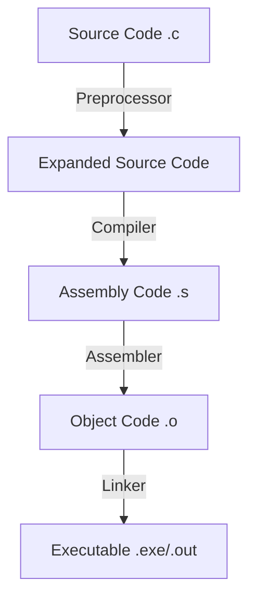

# Unit 3: Advanced C Programming Concepts

## Table of Contents

1. [C-Preprocessor Directives](https://www.google.com/search?q=%231-c-preprocessor-directives "null")

2. [User Defined Data Types](https://www.google.com/search?q=%232-user-defined-data-types "null")
   
   - Structures
   
   - Unions
   
   - Enumerations (Enum)

3. [Dynamic Memory Allocation (DMA)](https://www.google.com/search?q=%233-dynamic-memory-allocation-dma "null")

4. [File Handling](https://www.google.com/search?q=%234-file-handling "null")

## 1. C-Preprocessor Directives

The **C Preprocessor** is a unique text-substitution tool that processes your source code before the actual compilation begins. It handles directives that facilitate text replacement, file inclusion, and conditional compilation. It essentially prepares the raw source code for the compiler by stripping comments, expanding macros, and including necessary files.

### The Compilation Process

The transformation of human-readable C code into machine-executable binary involves four distinct stages. Understanding this pipeline is crucial for debugging errors like "undefined reference" (Linker error) vs "syntax error" (Compiler error).

Understanding where the preprocessor fits is crucial for debugging. It is the first phase of translation.



- **Preprocessor:** Resolves `#` directives.

- **Compiler:** Translates C syntax into assembly language.

- **Assembler:** Converts assembly to machine code (binary).

- **Linker:** Combines object files and libraries into a single executable.

#### 1. Preprocessing (The Text Substitution Phase)

- **Input:** Source file (e.g., `hello.c`)

- **Output:** Expanded source code (e.g., `hello.i`)

- **Action:** This stage modifies the text of the program before compilation.
  
  - **Comment Removal:** All comments (`//` and `/* ... */`) are stripped out completely.
  
  - **Macro Expansion:** All `#define` macros are replaced with their defined values or code snippets.
  
  - **File Inclusion:** The content of header files (like `<stdio.h>`) is physically pasted into the file where `#include` is written.
  
  - **Conditional Compilation:** Code inside `#ifdef` / `#endif` blocks is either kept or removed based on logic.

#### 2. Compilation (The Translation Phase)

- **Input:** Expanded source code (`hello.i`)

- **Output:** Assembly code (`hello.s`)

- **Action:** The compiler translates high-level C code into low-level assembly language specific to the target CPU architecture (e.g., x86, ARM).
  
  - **Syntax Checking:** Checks for grammar errors (missing semicolons, type mismatches).
  
  - **Optimization:** The compiler may rearrange instructions to make the code faster or smaller (e.g., removing variables that are never used).

#### 3. Assembly (The Binary Conversion Phase)

- **Input:** Assembly code (`hello.s`)

- **Output:** Object code (`hello.o` or `hello.obj`)

- **Action:** The assembler translates assembly instructions (mnemonics like `MOV`, `ADD`, `JMP`) into machine code (binary 0s and 1s).
  
  - The output is a **Relocatable Object File**. It contains machine code but cannot run yet because function addresses (like `printf` or other external functions) are not yet resolved (they are just placeholders).

#### 4. Linking (The Building Phase)

- **Input:** Object codes (`hello.o`, `utils.o`) and Static Libraries (`libc.a`)

- **Output:** Executable file (`a.out` or `hello.exe`)

- **Action:** The linker combines multiple object files and system libraries into a single executable program.
  
  - **Symbol Resolution:** Links function calls (e.g., `printf`) to their actual definitions in the standard C library.
  
  - **Address Binding:** Assigns final memory addresses to all code and data.
  
  - **Error Note:** If you declare a function but forget to define it, the Linker throws an "Undefined Reference" error here.

All preprocessor directives start with a hash symbol (`#`) and, unlike C statements, do not end with a semicolon.

### A. Macro Substitution (`#define`)

Macros are used to define constants or create parameterized templates (function-like macros). They improve performance by avoiding function call overhead, as the code is pasted inline.

**1. Object-like Macros (Constants):** Replaces a symbolic name with a literal value throughout the code. This avoids "magic numbers" in your code, making it easier to update values like buffer sizes or mathematical constants globally.

```c
#define PI 3.14159
#define MAX_SIZE 100
#define SUCCESS 1
```

**2. Function-like Macros:** Acts like a function but injects code directly. While faster (no stack frame creation), they are prone to side effects if not defined carefully.

```c
// Syntax: #define name(params) replacement
// CRITICAL: Parentheses are required around arguments and the whole expression.
#define SQUARE(x) ((x) * (x)) 

// Usage
int area = SQUARE(5);     // Expands to: ((5) * (5)) -> 25
int bad  = SQUARE(2 + 3); // Expands to: ((2 + 3) * (2 + 3)) -> 25

// WITHOUT Parentheses: #define BAD_SQUARE(x) x * x
// BAD_SQUARE(2 + 3) would expand to: 2 + 3 * 2 + 3 = 2 + 6 + 3 = 11 (Incorrect!)
```

### B. File Inclusion (`#include`)

This directive literally copies the contents of another file into the current file at the line where `#include` appears.

1. **Standard Header Files (`<>`):** Instructs the preprocessor to look in the standard system directories (e.g., `/usr/include`).
   
   ```c
   #include <stdio.h> // Contains declarations for I/O functions like printf
   ```

2. **User-Defined Header Files (`""`):** Instructs the preprocessor to look in the current directory first. If not found, it then checks system directories.
   
   ```c
   #include "myheader.h" // Useful for modular programming
   ```

### C. Conditional Compilation

This allows you to select blocks of code to be compiled or ignored. This is heavily used for writing portable code (code that runs on Linux, Windows, and macOS) or for debugging.

- **Directives:** `#ifdef`, `#ifndef`, `#if`, `#elif`, `#else`, `#endif`

**Example: Cross-Platform Compatibility & Debugging**

```c
#define WINDOWS 1
#define DEBUG_MODE 1

// Platform specific includes
#ifdef WINDOWS
    #include <windows.h>
#else
    #include <unistd.h>
#endif

// Debugging macro
void log_message(char *msg) {
    #ifdef DEBUG_MODE
        printf("DEBUG: %s\n", msg);
    #endif
}
```

### D. Miscellaneous Directives

- `#undef`: Removes a macro definition. Useful if you need to redefine a macro with a new value.

- `#pragma`: A special directive to turn on/off specific compiler features.
  
  - *Example:* `#pragma pack(1)` forces the compiler to store structure members contiguously without padding bytes (saves memory, sacrifices speed).

- `#error`: Stops compilation immediately and displays a custom error message. Used to enforce configuration requirements.

## 2. User Defined Data Types

C allows programmers to define their own data types based on built-in types. This facilitates modeling real-world entities (like a Student, Employee, or Hardware Register).

### A. Structures (`struct`)

A structure is a user-defined data type that allows grouping variables of **different data types** under a single name.

**Memory Alignment & Padding:** In memory, structure members are stored sequentially. However, to optimize CPU access speed, compilers often insert "padding" (empty bytes) between members so that integers and floats align with 4-byte or 8-byte boundaries.

**Syntax:**

```c
struct StructureName {
    dataType member1;
    dataType member2;
    ...
};
```

**Example Code:**

```c
#include <stdio.h>
#include <string.h>

// Definition
struct Student {
    int id;           // 4 bytes
    char name[20];    // 20 bytes
    float percentage; // 4 bytes
    // Total theoretical size: 28 bytes
    // Actual size might be 28 or 32 depending on alignment
};

int main() {
    struct Student s1;

    // Accessing members using dot (.) operator
    s1.id = 101;
    strcpy(s1.name, "Alice");
    s1.percentage = 92.5;

    printf("ID: %d, Name: %s\n", s1.id, s1.name);
    return 0;
}
```

### B. Unions (`union`)

A union is similar to a structure in syntax but conceptually distinct. In a union, all members **share the same memory location**. The size of the union is determined by the size of its *largest* member.

**When to use:** Unions are useful when you need to store different types of data in the same memory area at different times (e.g., an input event that can be a mouse click OR a key press), or for low-level hardware access.

**Memory Diagram Comparison:**

```graphql
STRUCT: struct { char a; int b; }     UNION: union { char a; int b; }
(Allocates memory for BOTH)           (Allocates memory for LARGEST)

| [a] | [pad] | [pad] | [pad] | [b] | [b] | [b] | [b] |       | [ b (4 bytes) ] |
| 1B  |  1B   |  1B   |  1B   | 4B                      |       | [ a ]           |
Total Size >= 5 (usually 8 w/ pad)    Total Size = 4 bytes
```

**Key Characteristic:** Writing to one member modifies the binary data of all other members.

**Example Code:**

```c
#include <stdio.h>

union Data {
    int i;
    float f;
    char str[20];
};

int main() {
    union Data data;

    data.i = 10;
    printf("data.i: %d\n", data.i);

    // Overwriting memory
    data.f = 220.5; 

    // data.i is now corrupted because the bytes representing 10 
    // were overwritten by the bytes representing 220.5
    printf("data.f: %f\n", data.f);
    printf("data.i (corrupted): %d\n", data.i); 

    return 0;
}
```

### Comparison: Structure vs. Union

| Feature               | Structure (`struct`)                              | Union (`union`)                                         |
| --------------------- | ------------------------------------------------- | ------------------------------------------------------- |
| **Keyword**           | `struct`                                          | `union`                                                 |
| **Memory Allocation** | Allocates memory for **all members** summatively. | Allocates memory **only for the largest member**.       |
| **Access**            | All members can be accessed at the same time.     | Only **one member** can be accessed at a time.          |
| **Memory Sharing**    | Members have distinct memory addresses.           | All members **share the same** starting memory address. |
| **Size**              | Sum of sizes of all members (plus padding).       | Size of the largest member only.                        |
| **Value Alteration**  | Changing one member does **not** affect others.   | Changing one member **overwrites/corrupts** others.     |
| **Use Case**          | Storing complex records (Student, Book).          | Memory optimization, hardware registers, variant types. |

### C. Enumerations (`enum`)

An enum is a user-defined type consisting of a set of named integer constants. It makes code more readable and maintainable compared to using multiple `#define` statements or raw integers (0, 1, 2).

**Syntax:**

```c
enum State {
    WORKING = 1,
    FAILED = 0,
    FREEZED = -1
};
```

*If values are not explicitly assigned, the first constant is 0, and subsequent constants increment by 1.*

**Example:**

```c
enum Week {MON, TUE, WED, THU, FRI, SAT, SUN}; 
// MON=0, TUE=1, WED=2, etc.

int main() {
    // Using enum makes the code self-documenting
    enum Week today = WED;

    if (today == WED) {
        printf("It is the middle of the week.\n");
    }

    printf("Day index: %d", today); // Output: 2
    return 0;
}
```

## 3. Dynamic Memory Allocation (DMA)

In standard variable declaration (arrays, local variables), memory is allocated on the **Stack** at compile time. This is rigid—you must know the size beforehand. **DMA** allows you to allocate memory at **runtime** from the **Heap** segment, enabling programs to handle variable amounts of data (e.g., a user entering 10 items or 1 million items).

**Library:** `<stdlib.h>`

### Comparison: Static vs. Dynamic Memory Allocation

| Feature             | Static Memory Allocation                    | Dynamic Memory Allocation                    |
| ------------------- | ------------------------------------------- | -------------------------------------------- |
| **When it happens** | **Compile Time** (before execution).        | **Runtime** (during execution).              |
| **Memory Segment**  | **Stack** (or Data/BSS for globals).        | **Heap**.                                    |
| **Size**            | Fixed; must be known in advance.            | Flexible; determined during execution.       |
| **Resizing**        | Impossible once allocated.                  | Possible using `realloc()`.                  |
| **Deallocation**    | **Automatic** (when function/program ends). | **Manual** (must use `free()`).              |
| **Efficiency**      | Faster execution (no allocation overhead).  | Slower execution (managing heap is complex). |
| **Pointer usage**   | Not required (variables accessed by name).  | **Required** to access the allocated memory. |

### Functions Overview

| Function      | Description                                                | Initial Value    | Syntax                                          |
| ------------- | ---------------------------------------------------------- | ---------------- | ----------------------------------------------- |
| **malloc()**  | Allocates a single large block of memory. Returns `void*`. | Garbage Value    | `ptr = (castType*) malloc(byteSize);`           |
| **calloc()**  | Allocates multiple blocks (contiguous).                    | Zero-initialized | `ptr = (castType*) calloc(count, elementSize);` |
| **realloc()** | Expands/Shrinks previously allocated memory.               | Preserves data   | `ptr = realloc(ptr, newTotalSize);`             |
| **free()**    | Releases memory back to the heap.                          | N/A              | `free(ptr);`                                    |

### Detailed Examples

#### 1. `malloc()` (Memory Allocation)

`malloc` allocates raw bytes. We typically multiply the number of items needed by `sizeof(type)` to ensure cross-architecture compatibility.

```c
int *ptr;
int n = 5;
// Requesting memory for 5 integers
ptr = (int*) malloc(n * sizeof(int)); 

// ALWAYS check for NULL (heap might be full)
if (ptr == NULL) {
    printf("Memory not allocated.\n");
    exit(0);
}
```

#### 2. `calloc()` (Contiguous Allocation)

`calloc` stands for "contiguous allocation". It is slightly slower than `malloc` because it performs an extra step: initializing all bits to zero. This is useful for arrays where you want a default empty state.

```c
int *ptr;
ptr = (int*) calloc(5, sizeof(int)); 
// ptr[0] through ptr[4] are guaranteed to be 0
```

#### 3. `free()` (Deallocation)

**Critical:** Heap memory is not managed by the OS until the program terminates. If you lose the pointer to allocated memory without freeing it, that memory remains occupied. This is a **Memory Leak**.

```c
free(ptr);
// After free, 'ptr' still holds the address, but the memory is gone.
// Accessing it now causes a crash. This is a "Dangling Pointer".
ptr = NULL; // Best practice: set to NULL immediately.
```

### Comparison Diagram (Stack vs Heap)

```graphql
+------------------+ High Address
|  Command Line    |
|    Arguments     |
+------------------+
|      Stack       |  <-- Fast, automatic allocation. Limited size.
|        ||        |      Variables die when function returns.
|        \/        |  
|                  |
|                  |
|        /\        |  
|        ||        |      Large, manual allocation. 
|       Heap       |  <-- User controls lifetime (malloc -> free).
+------------------+      Slower access than stack.
|   Uninitialized  |  
|   Data (BSS)     |
+------------------+
|  Initialized     |
|      Data        |
+------------------+ Low Address
```

### Comparison: `malloc` vs. `calloc`

| Feature            | `malloc()`                                     | `calloc()`                                                 |
| ------------------ | ---------------------------------------------- | ---------------------------------------------------------- |
| **Full Name**      | Memory Allocation.                             | Contiguous Allocation.                                     |
| **Arguments**      | Takes **1 argument**: `(size_in_bytes)`.       | Takes **2 arguments**: `(number_of_items, size_per_item)`. |
| **Initialization** | Contains **Garbage Values**.                   | Initializes all bytes to **Zero**.                         |
| **Speed**          | Faster (doesn't spend time clearing memory).   | Slower (has overhead of zeroing out memory).               |
| **Security**       | Less secure (might expose old data in memory). | More secure (wipes old data).                              |

## 4. File Handling

File handling allows programs to persist data permanently on a disk. Without files, all data (stored in RAM) is lost when the program terminates. C uses a structure called `FILE` (defined in `<stdio.h>`) to act as a stream interface between the program and the storage device.

### Basic Operations

1. **Opening**: `fopen()` creates a stream and links it to a file.

2. **Processing**: Reading/Writing characters, strings, or blocks of data.

3. **Closing**: `fclose()` flushes any buffered data to the disk and releases the file pointer.

### File Opening Modes

| Mode   | Description     | Behavior if file exists        | Behavior if file missing |
| ------ | --------------- | ------------------------------ | ------------------------ |
| `"r"`  | Read Only       | Opens file                     | Returns NULL (Error)     |
| `"w"`  | Write Only      | **Truncates (erases) content** | Creates new file         |
| `"a"`  | Append          | Opens, moves cursor to end     | Creates new file         |
| `"r+"` | Read + Update   | Opens file                     | Returns NULL             |
| `"w+"` | Write + Update  | **Truncates content**          | Creates new file         |
| `"a+"` | Append + Update | Appends to end                 | Creates new file         |

*Note: Adding `b` (e.g., `"rb"`, `"wb"`) opens the file in **Binary Mode**. In binary mode, special characters like Newline (`\n`) are treated as raw bytes, whereas in Text mode, the OS might translate `\n` to `\r\n` (Windows).*

### Code Example: Writing and Reading a Text File

```c
#include <stdio.h>
#include <stdlib.h>

int main() {
    FILE *fptr;
    char ch;

    // --- WRITING ---
    // Open file in write mode
    fptr = fopen("data.txt", "w");
    if (fptr == NULL) {
        printf("Error: Could not create file.\n");
        exit(1);
    }

    // fprintf works just like printf, but sends output to file
    fprintf(fptr, "Hello World\n");
    fprintf(fptr, "Number: %d", 100);

    fclose(fptr); // Closing flushes the buffer to the disk

    // --- READING ---
    // Open file in read mode
    fptr = fopen("data.txt", "r");
    if (fptr == NULL) {
        printf("Error: File not found.\n");
        exit(1);
    }

    printf("\nFile Content:\n");
    // Read char by char until End Of File (EOF) marker is reached
    while ((ch = fgetc(fptr)) != EOF) {
        printf("%c", ch);
    }

    fclose(fptr);
    return 0;
}
```

### Binary File Handling (`fread` / `fwrite`)

Binary functions are essential when storing complex data types like Arrays or Structures. Writing a struct as text requires complex parsing to read it back. Writing it as binary dumps the raw memory of the struct directly to disk.

**Algorithm for Binary Write:**

1. Define a structure.

2. Open file in `"wb"` (Write Binary).

3. Use `fwrite(address, size_of_element, count, file_pointer)`.

4. Close file.

**Code Example (Binary Struct):**

```c
struct Record {
    int x;
    int y;
};

// Writing
struct Record r1 = {10, 20};
FILE *fp = fopen("struct.bin", "wb");
// Writes the exact 8 bytes of the struct to disk
fwrite(&r1, sizeof(struct Record), 1, fp);
fclose(fp);

// Reading
struct Record r2;
fp = fopen("struct.bin", "rb");
// Reads 8 bytes from disk directly into memory
fread(&r2, sizeof(struct Record), 1, fp);
printf("Read: %d, %d", r2.x, r2.y);
fclose(fp);
```

### Random Access Functions

These functions allow you to jump to arbitrary locations in a file, rather than reading sequentially from start to finish.

- `fseek(FILE *stream, long offset, int whence)`: Moves the file cursor.
  
  - `SEEK_SET`: Offset from **beginning** of file.
  
  - `SEEK_CUR`: Offset from **current** position.
  
  - `SEEK_END`: Offset from **end** of file (useful for finding file size).

- `ftell(FILE *stream)`: Returns current cursor position (in bytes).

- `rewind(FILE *stream)`: Resets cursor to the start (equivalent to `fseek(stream, 0, SEEK_SET)`).
